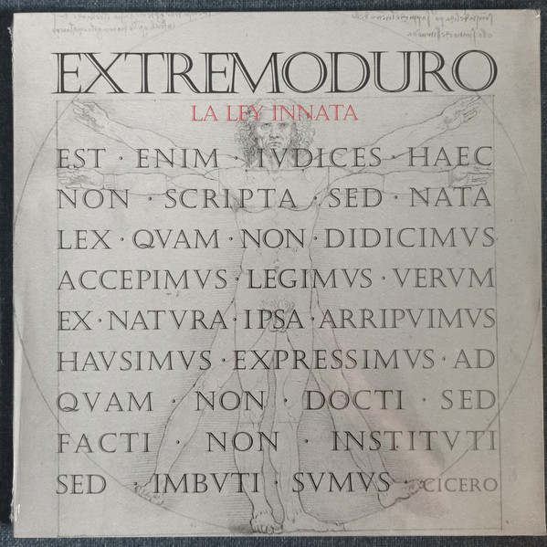
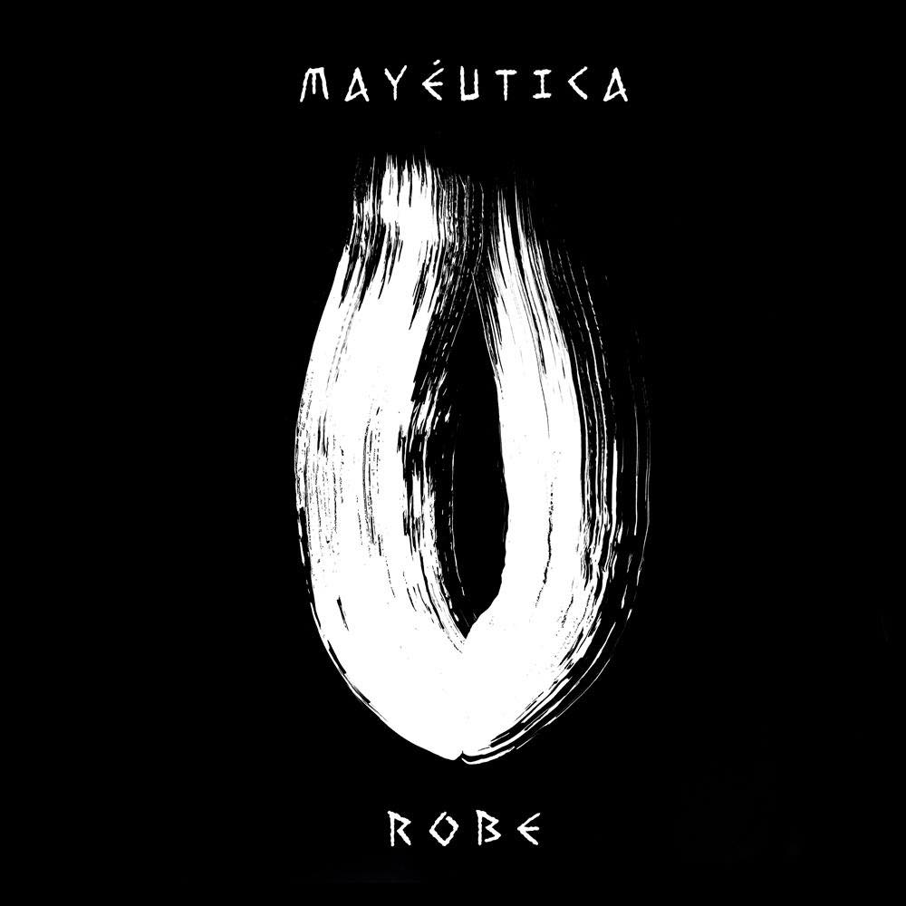

# Mis albumes Favoritos
---
## Artista

### Robe Iniesta

Roberto Iniesta Ojea, conocido artísticamente como Robe, es un músico, compositor, escritor y poeta español nacido en Plasencia el 16 de mayo de 1962, ampliamente reconocido como una de las figuras más influyentes y revolucionarias de la historia del rock en español. Saltó a la fama mundial como el fundador, líder y principal compositor de la mítica banda Extremoduro, formación nacida en 1987 con la que creó el concepto de ***rock transgresivo***, fusionando la crudeza del rock urbano con una sensibilidad poética lírica y desgarradora que marcó a varias generaciones. Tras el cese de la actividad de la banda y su disolución definitiva, ha consolidado una exitosa y madura carrera en solitario respaldado por su actual banda, publicando álbumes muy aclamados por la crítica, al tiempo que ha explorado su faceta literaria como novelista y ha sido galardonado con prestigiosas distinciones como la Medalla de Oro al Mérito en las Bellas Artes.

---
---

# Mi álbum Favorito

## Extremoduro

### **La Ley Innata**

**La ley innata** es un álbum conceptual de Extremoduro estructurado como una única obra sinfónica de 45 minutos y 7 segundos de duración, la cual gira en torno a la cita del filósofo romano Cicerón sobre la existencia de una ley natural, moral e instintiva que es intrínseca al ser humano y que no necesita ser aprendida ni impuesta por la sociedad. A través de un prólogo, cuatro movimientos y un epílogo flamenco, las letras de Roberto Iniesta fusionan la poesía transgresiva con el rock progresivo para narrar un viaje introspectivo cargado de dualidades: el amor y el desamor, la libertad individual frente a las normas sociales, el caos frente al orden, y la búsqueda de la belleza dentro de la cruda realidad. Musicalmente, esta narrativa se apoya en una compleja amalgama de guitarras duras, arreglos de cuerda (violín y violonchelo) y pasajes instrumentales que reaparecen como motivos recurrentes a lo largo de todo el disco, creando una atmósfera melancólica y visceral.

---

## Robe Iniesta

### **Mayéutica**

**Mayéutica** es el tercer álbum de estudio en solitario de Robe (Roberto Iniesta, líder de Extremoduro), publicado el 30 de abril de 2021, y está concebido conceptualmente como una única canción continua de 43 minutos y 49 segundos de duración. Esta obra funciona como la secuela directa de La ley innata, retomando la misma estructura sinfónica compuesta por un interludio, cuatro movimientos musicales y una coda, además de rescatar los mismos motivos líricos y musicales trece años después. El disco gira en torno al concepto filosófico de la mayéutica atribuido a Sócrates (el arte de dar a luz a la verdad a través del diálogo), pero adaptado al universo de Robe como el doloroso y catártico proceso de "dar a luz" al amor, la pasión y el deseo absoluto tras una etapa de oscuridad creativa. Musicalmente, es un viaje de rock progresivo y transgresivo muy dinámico, donde las guitarras eléctricas pesadas ganan mucho más protagonismo que en su predecesor, entrelazándose de forma brillante con arreglos de violín, saxofón y sintetizadores que marcan el clímax emocional de la obra de principio a fin.

---
---

# Más sobre mí 
[Sobre mí](pagina2.md)